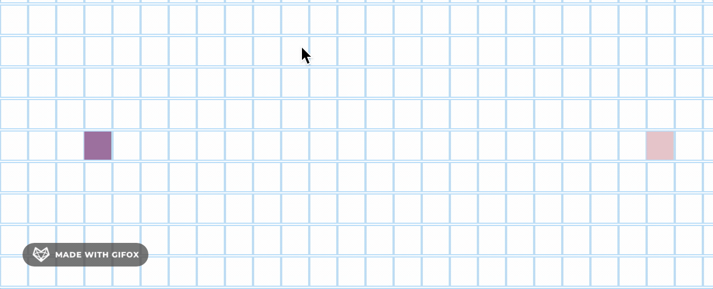
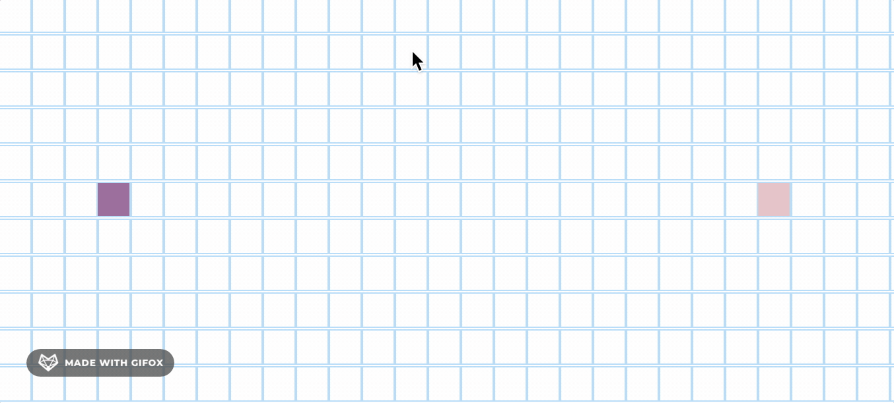
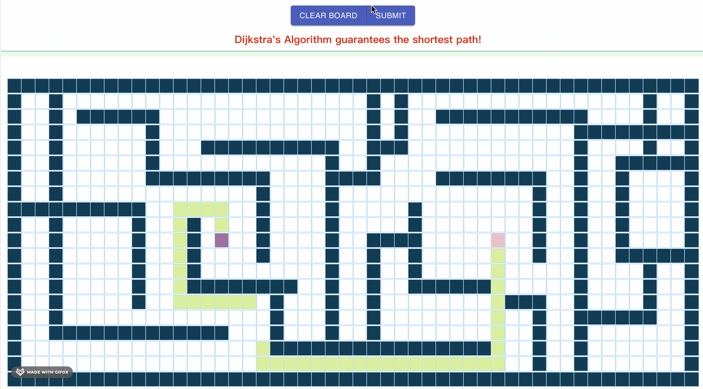
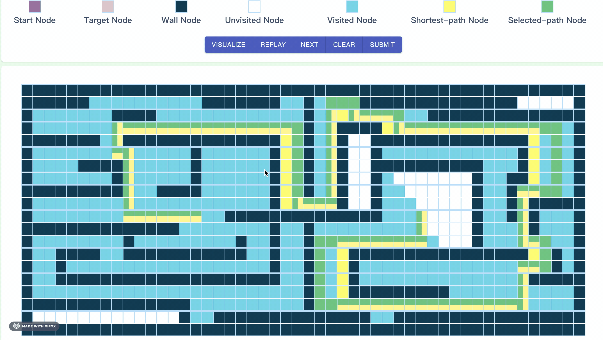

# Mazer
Mazer is an educational online game site for users to
familiarize themselves with the process of finding the shortest path by providing interactive maze games
and visualizing execution of pathfinding algorithms step by step with cool animation. We designed the
Mazer for those people who are curious about how to find the shortest path more quickly and accurately.

## Getting Started

```
https://github.com/csc309-fall-2020/team16.git
cd team16
mkdir mongo-data
mongod --dbpath mongo-data
npm install
cd client
npm install
npm run build
cd ..
node server.js
```
## Heroku Link
https://peaceful-ravine-90848.herokuapp.com/

## Signin and Signup Page
- **Functionality overview:** Use the user and administrator accounts that we provide, you are able to login to the User Page and Admin Page separately. Click the Sign up or Create an account button, you can switch to the Signup Page and get a new user account by inputting username, password and email. For the signing up page, we set the username and email unique, and the length of password must be greater than four letters.

- **User account:** The user account can be logged in with username "user" and password "user", you can also register a user account by filling the "Sign Up" form. 

- **Administrator account:** The administration account can be logged in with username "admin" and password "admin".

- **POSTMAN create account:** If you would like to use Postman to create a account, you can send the POST {"username":"", "email":"", "password":"", "role":""} to user or admin routes.

## User Page
- **Functionality overview:** In User page we have two main sections, Practice and Game, user uses Practice page as exercising and gets familiar with algorithms that we provided. The stage mode is provided in Game section, user will get a score based on the performance of the path that they select, the scores will in recoreded in the user profile.

- **Tutorial:** After logging in, an instruction tutorial is prepared to users in . It displays a clear introduction step by step with brief messages and animated GIFs. For a new user, the tutorial page is of great help to learn how to practice and play in this webpage. As for regular users, they can skip this tutorial by clicking the "CLOSE" button. 

- **Navigation bar:** Users are then led to the practice page by default. Users can see a horizontal navigation bar at the top of the webpage. From left to right, there are one icon and several features buttons. Below the navigation bar is the grid maze. All our path-finding functions can be visualized on it.

- **User profile:** It is on the upper-left corner of the page. Move mouse over the icon, a dropdown menu will show the user’s information, including their username, email, and game scores of each round.

- **Update Icon:** User can update the default icon by clicking the icon and upload a new image. A page jumps and provides a button to upload a image from your local computer. If the user successfully uploads his chosen image, the page will display a green success message below the upload button. The user can also check the image they upload by clicking the "show image" button. Then users can exist the page by clicking the "close" button.

- **Practice page:** Users can access the practice page by clicking the “Practice” button on the navigation bar. Users can use this page to learn and practice. They can build or cancel arbitrary maze walls by clicking on the grid cells, change the location of start and end point by dragging them. We also provide four pathfinding algorithms, including breath-first search, depth-first search, A* search and dijkstra's algorithm. You can choose one of them to visualize how this algorithm finds the path. After the path is found, the user can click the “Clear Board”  or "Clear Path" button on the navigation bar to clear everything or clear the path on the grid and do next practice.  </br>
:star2:Click the grid cell to create the wall and click the wall to eliminate it.:point_down:    
:star2:Click and hold the mouse, then drag the mouse over the grid cell to create the wall.:point_down:



- **Game page:** Users can access the game page by clicking the “Game” button on the navigation bar. Then user could select one round to play. There are several rounds provided by the Game page. Users can also choose the round they want to participate by clicking the “round” button on the navigation bar. At the beginning of each round, the toturial will jump out, click NO to go back to the practice page, or click YES to begin the game and start the timer. On the game page, we provide several mazes to the user, the user can select a path by clicking on the grid cells. Users press the “Submit” button to indicate they finish the path. The system will check whether the path is a completely connected path from the start node to the target node. If the user pass the round, our website will show the complete time and score, then the user could click "Visualize" button to visualize the shortest path selected by algorithm. After path-finding animation, if users move their mouse over the shortest path or the path selected by themselves, the corresponding path will be highlighted.  
:star2:After complete the round, click SUBMIT to get a score and click VISUALIZE to see the algorithm pathfinding process:


:red_circle::heavy_exclamation_mark:**IMPORTANT: Any two grid cells are regarded as connected only when they are adjacent vertically or horizontally.**:heavy_exclamation_mark::red_circle:  



:star2:Move the mouse over a path to highlight it:point_down:



- **Algorithm:** Users can be shown the visualizing pathfinding process by clicking the “algorithm” button on the navigation bar and choose the algorithm they want in the dropdown menu. Four algorithms provide for users to select to visualize, Dijkstra, A* Search, Depth-first Search (DFS), Breath-first Search (BFS). The default Algorithm setting is Dijkstra.

- **Speed Control:** Users can choose the visualizing pathfinding process speed from "Slow", "Average", "Fast" options, the default speed option is "Fast".

- **Signout**: Users can go back to the sign in page by clicking the “Sign Out” button on the navigation bar.

## Administrator Page
- **Functionality overview:** The administrator uses a specific login account that we provided to enter into the admin page, he/she can do different manipulations by clicking on the left side bar.

- **User list**: Admin can add new user or delete the existing user, these operations are synchronized with the database. There is a list to show the user’s username and email, which can be got from the database. Admin can also sort users in different ways after clicking the corresponding labels in table headers. Besides, admin can also search users in the list by username or email.

- **Game rank:** Rank for each round will display there. The users will be ranked by their complete time in the corresponding round. If two users have the same complete time, the one with higher score will get a higher rank. 

- **Update maze:** Admin can modify the maze for each round or clear the maze, also can add more rounds or delete round for the Game part. There are two buttons at the top of the page, one is "Add round" and the other is "Delete round". If you click "Add round",  a new round with an empty maze will be created as the last round. If you click the "Delete round" button, the last round with the maze will be deleted and all users' score at this round will also be cleared. For each maze, there are two buttons at bottom left, which are "edit" and "clear" button. When you click "clear" button, the corresponding maze will be cleared and all users' scores at this round will also be cleared, so be careful to click clear button. If you click the edit button, you will go to edit maze page. At this page, admin can design different mazes by clicking node to create wall. Admin can click save button to save the maze to database, click reload button to reload lastest saved maze and click exit button to go back. The maze information are synchronized to store into the database, so that the maze in Game page will be also updated. 
:warning: **Be careful to click "clear" and "Remove maze" button.**

:red_circle::heavy_exclamation_mark:**IMPORTANT: After Admin updates the mazes, refreshing the Login page is required for synchronizing the new mazes information in User's Game page.**:heavy_exclamation_mark::red_circle: 

## Database Structure and Construction

- **Overview:** MongoDB database stores the user information and maze information, it is a connection between the admin and user page. We build three schemas in our MazerAPI: users, roundscores and mazes.

- **user Schema:** Five key components store in database for each user: username, email, password, image_url and role. The first three components are for user authentication section, especially for the login page. We use username and password to confirm the user’s identity. We store and manage the original photos of users' icon images in Cloudinary, so the component "image_url" is for storing the cloudinary url of user's latest icon image. The last component "role" can be set as "user" or "admin". In login page, different role will enter into their corresponding page.

- **roundscores Schema:** The best scores for each user in each round store in roundscores schema, which we apply to rank users for each round and the ranking result display in Game Rank in Admin page. It has six features: round, bestScore, bestTime, times, totalTime and creator. We identify the user by assigning the user's id to "creator". 

- **mazes Schema:** The schema "mazes" encodes mazes and stores them in the form of matrix. It has six main components: startNode, endNode, round, encodedMaze, createdTime, modifiedTime. "startNode" and "endNode" record the coordinates of the two nodes. "round" records the round number. "encodedMaze" is a list of 0s and 1s, where 1 represents its corresponding grid cell is a maze wall. "createdTime" and "modifiedTime" are for administrators, which help them manage mazes in "Update Maze" section. 

## Server

### Overview of the routes 
#### Users routes 
* **/api/users/register** 
    This post route is used to register a user. The expected data should include a username, a valid email, and a password of at least 4 characters as shown below. If the user registered successfully, it would return the information of newly registered user.
    ```json
    {
        "username":"user",
        "email":"user@gmail.com",
        "password":"user"
    }
    ```

* **/api/admins/register**
    This post route is used to register a administrator. The expected data also should include a username, a valid email, and a password of at least 4 characters. If the administrator registered successfully, it would return the information of the administrator.
    ```json
    {
        "username":"admin",
	    "email":"admins@gmail.com",
	    "password":"admin"
    }
    ```

* **/api/users/login**
    This post route is used to log in for a registered user. You should make sure you have registered, and then the expected data should include the correct username and password as following. If users logged in successfully, their information would be returned as "currentUser".
    ```json
    {
        "username":"user",
        "password":"user"
    }
    ```

* **/api/users/check-session**
    This get route is used to check whether the user has logged in. If the user has logged in, it would return the information of the user as shown below.
    ```json
    {
        "currentUser": {
            "id": "5fd28d8965216a0c17257501",
            "username": "user",
            "email": "user@gmail.com",
            "role": "user"
        }
    }
    ```

* **/api/users/logout**
    This get route is used to log out. Make sure you are logged in, and then you would recieve the "Log out Successfully" message after logging out.

* **/api/users/getAll**
    This get route is used to get all registered users. Before sending the request, you should make sure you have logged in, then the expected result would be an array containing all users' information.

* **/api/users/getimage**
    This get route is used to get the URL for the current user's profile photo. If you have logged in, then the expected result is the URL.

* **/api/users/updateImage**
    This patch route is used to update the image for the current user's profile photo. Before sending the request, please register and log in. The expected data should be form-data and the type of the key should be file, then select the image on your computer. The expected result would be the URL of your image stored on Cloudinary.

* **/api/users/delete/:id**
    This delete route is used to delete the user with the corresponding id. You can use the id : 5fd04c8881aab500178de35d for test. The expected result would be like the following:
     ```json
    {
        "n": 1,
        "ok": 1,
        "deletedCount": 1
    }
    ```
    
#### Scores routes
* **/api/game/initRoundScore**
    This post route is used to initialize the score for the current user in the corresponding round. Before sending the request, please log in. The expected data should include corresponding score, bestScore, bestTime, times and totalTime as shown below. The current user should be a newly registered user and have not played the game yet. The round should not exceed the number of rounds we provided in game mode and the values of bestScore, bestTime, times and totalTime should be the same as below. The result would be the structure of the newly created score.
    ```json
   {
    	"round": "1",
    	"bestScore": "-1",
    	"bestTime":"-1",
    	"times":0,
    	"totalTime":0
    }
    ```
    
* **/api/game/updateRoundScore**
    This patch route is used to update the score in one round. You should log in at first and the expected data should include round, currentScore, pass and time as following. The round should not exceed the number of rounds we provided in game mode, the currentScore should be in the range of 0 and 100, the pass indicates whether the current user passes the current round and the time means the total seconds the user used in corresponding round. If you updated successfully, the result would be an "Update score successfully" message. 
    ```json
   {
    	"round": "1",
    	"currentScore": "80",
    	"pass":"true",
    	"time":"44"
    }
    ```

* **/api/roundScores**
    This get route is used to get all scores of the current user. You should log in at first and the expected result should be an array including all scores.

* **/api/roundScores/:round**
    This get route is used to get scores of all users for the corresponding round. The round should not exceed the number of rounds we provided in game mode and the expected result should be an array containing all users who have scores for the corresponding round. If no user passed the corresponding round, the result array would be an empty array.

* **/api/roundScores/reset/:round**
    This get route is used to reset all users' scores at the corresponding round back to the initialized state when admin delete the maze at the corresponding round. The round should not exceed the number of rounds we provided in game mode and the expected result would be a "Reset successfully" message.

#### Mazes routes

* **/api/admit/editMaze/create/:round**
    This post route is used to create a new maze. You should log in as a administrator at first and the expected result should include encodedMaze, startNode and endNode as shown below. The round you want to create should not exist in our maze database and the encodedMaze should be "Init". The startNode and endNode should be an array and the first element indicates the row in the grid and the second element indicates the col in the grid. The value of row and col should be in the range of [0, 20] and [0, 50] respectively.
    ```json
    {
    	"encodedMaze": "Init",
    	"startNode": [9, 10], 
    	"endNode":[9, 30]
    }
    ```
    
* **/api/admit/editMaze/update/:round**
    This patch route is used to update the structure of the maze in the corresponding round. You should log in as a administrator at first and the expected result should include encodedMaze, startNode and endNode as shown below. The round you want to update should exist in our maze database and the encodedMaze should be a string that consists of "0" and "1" and the length is 1000. The "0" indicates a empty node and the "1" indicates a wall. You could use encodedMaze we procided in the following example. The expected result should be an "Update maze successfully" message.
     ```json
    {
    	"encodedMaze": "1111111111111111111111111111111111111111111111111110000100000000000000001000000010000000100010001001100001111000000000000010000000100000001000111110011000010000001111111100111111111111111110000000100110011100000010100000000100000000001000111111111001100010001111101111110001110010000010001001000010011000100000000010000100010000110011100010010000000110001000001110100111000100001000100000100111111111100011111110101001000000000010001111101000000100011000100100001000011111111111100010001110000001000111111001000010000100000010101000100000111110010101100000010000100001111111101010001000000000000101011000000111111111110000001010000010011111111111010110011111010000100000000010111100100000001000000101100010000111101000000000100001001111110011111101011000100001001011111111001000010000000100100010010110001001111110000010000011111101111001001000100101111110010000100000111111100000000010000010001111111000000000001000001000000000000000100000100000000111111111111111111111111111111111111111111111111111",
    	"startNode": [9, 10], 
    	"endNode":[9, 30]
    }
    ```
* **/api/admit/editMaze/get/:round**
    This get route is used to get the maze of the corresponding round. You should log in at first and the round should exist in our maze database. The expected result would be the structure of maze.

* **/api/admit/editMaze/getAllMazes**
    This get route is used to get all mazes. You should log in at first and the expected result should be an array of maze existing in the maze database.

* **/api/admit/editMaze/delete/:round**
    This delete route is used to delete the maze at the corresponding round. You should log in at first and the expected result should be the removed maze.

* **/api/admit/editMaze/clear/:round**
    This patch route is used to clear maze in the corresponding round. The expected data should include 'encodedMaze', 'startNode' and 'endNode'. The value of encodedMaze should be 'Init' and the value of startNode and endNode should be a array containing row and col as shown below. The expected result is a "Reset Maze successfully" message.
    ```json
    {
	    "encodedMaze": "Init",
    	"startNode": [9, 10], 
    	"endNode":[9, 30]
    }
    ```


## Third Parties

- react-router-dom: withRouter, NavLink, Route, BrowserRouter, Switch

- material-ui: Paper, Card, CardActionArea, CardMedia, Typogtaphy, Divder, ListItem, ListItemAvatar, ListItemText, Avatar, Grid, Button, TextField, Icons, MobileStepper, InputAdornment, IconButton, SearchBar, Snackbar, Alert, Dialog, DialogActions, DialogContent, DialogContentText, ButtonGroup

- react-uid: uid

- express: a Node.js web application server framework for buliding single or multiple page web application.

- body-parser: a the Node.js body parsing middleware

- express-session: stores only a session identifier on the client within a cookie and stores the session data on the server, typically in a database. 

- express-session Options: 
  - cookie.expires: the website cookie is setting to expire after one hour
  - saveUninitialized: setting to "false", it is useful for implementing login sessions, reducing server storage usage, or complying with laws that require permission before setting a cookie.
  - resave: setting to "false", do not force the session to be saved back to the session store. 

## Reference

1. [Dijkstra's Shortest Path Algorithm](https://brilliant.org/wiki/dijkstras-short-path-finder/)
2. [Build Your Own Confirm Dialog](https://www.youtube.com/watch?v=KOryCvYE4_s&t=1319s)
3. [Leader Board in HTML CSS and Javascript](https://www.youtube.com/watch?v=QSeInuHK5sg&t=1064s)
4. [React Sign Up Form Example](https://www.youtube.com/watch?v=56E8b9prPTs)
5. [React Material UI Table with Paging Sorting and Filtering](https://www.youtube.com/watch?v=jnQ1-XW7KNY)


   
